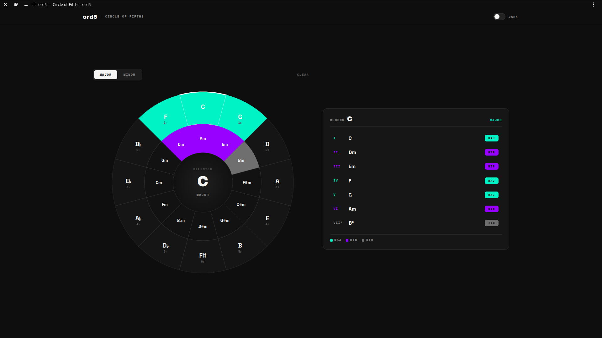
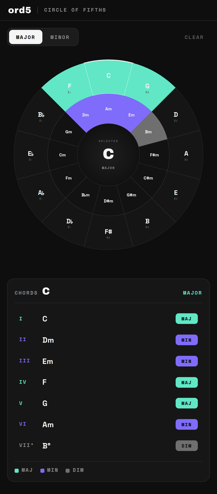

<div align="center">
  
  <h1>ord5</h1>
  <p>Interactive Circle of Fifths</p>

  <a href="https://shroomcoder.github.io/ord5/">
    
  </a>
  
  
  
</div>

<center>

🔗 [**Click here for the live demo**](https://shroomcoder.github.io/ord5/)

</center>

## About

**ord5** is an interactive Circle of Fifths music theory tool that helps you:

- View the standard Circle of Fifths with 12 major keys and their relative minors
- Click any wedge to select a key and see its diatonic chords with Roman numeral analysis (I, ii, iii, IV, V, vi, vii)
- Toggle between MAJOR and MINOR modes
- See chords highlighted on the wheel (major in mint/green, minor in purple, diminished in grey)
- Switch between DARK and LIGHT themes
- Experience correct enharmonic spelling for all keys

## Features

- ✅ All 12 major and minor keys
- ✅ Major/minor mode toggle with visual feedback
- ✅ Correct enharmonic spelling (including F#/D# with E# notation)
- ✅ Keyboard accessible wheel interaction (Tab/Enter/Space)
- ✅ ARIA-compliant for screen readers
- ✅ Dark/light theme toggle (OS preference on mobile)
- ✅ Service worker for offline caching
- ✅ Web App Manifest for installability
- ✅ Pure vanilla JavaScript — zero dependencies

## Screenshots

<div align="center">
  <br /><br />
  
</div>

## Quick Start

This project is a static site with no build step. Just serve it with any static file server:

```bash
# Using serve (recommended for development)
npx serve .

# Or any other static server:
python -m http.server 8000
cd ord5 && python -m http.server
```

Open `http://localhost:5000` (or equivalent) in your browser.

## PWA & Offline Support

ord5 is a Progressive Web App that works fully offline once installed — no server or internet connection required after the first load.

### Installing as a PWA

**Desktop (Chrome, Edge, Brave)**
1. Open the site in your browser
2. Click the install icon (⊕) in the address bar, or open the browser menu and choose **Install ord5**
3. Confirm the install prompt — ord5 now launches like a native app

**Android (Chrome)**
1. Open the site in Chrome
2. Tap the **⋮** menu → **Add to Home screen** (or **Install app**)
3. Confirm — an icon is added to your home screen

**iOS (Safari)**
1. Open the site in Safari
2. Tap the **Share** icon
3. Select **Add to Home Screen**
4. Confirm — ord5 launches in standalone mode from your home screen

Once installed, all assets are cached by the service worker, so the app continues to work without a network connection.

## Tech Stack

| Layer | Technology |
|-------|------------|
| **Language** | Vanilla JavaScript (ES6+) |
| **Markup** | HTML5 with semantic structure |
| **Styling** | Plain CSS3 (no preprocessor) |
| **Rendering** | Inline SVG generated dynamically |
| **PWA** | Service Worker + Web App Manifest |
| **Fonts** | Google Fonts (Archivo Black, Space Grotesk, Space Mono) |
| **Dependencies** | **Zero** — no npm, no build tools |

This is a pure zero-dependency static site that you can serve from any web server or even open directly as `index.html` (though the service worker requires a server for initial registration).

## License

MIT © 2026 mnxhh_eko — see [LICENSE](LICENSE) for the full text.
